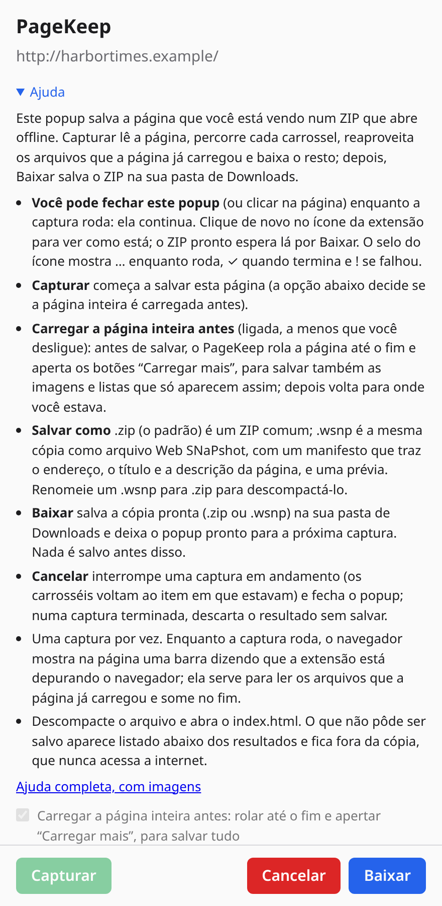

# PageKeep

**PageKeep** (até a versão 1.1.1 chamada Page Snapshot) é uma extensão para navegadores Chromium (Chrome, Opera, Edge e outros; Manifest V3) que salva a aba que você está vendo como um ZIP ou como um arquivo `.wsnp` (veja **Salvar como**, abaixo). Cada folha de estilo, imagem, fonte e ícone é baixado e a página é reescrita para apontar para as cópias locais: basta descompactar e abrir o `index.html`, a qualquer momento e sem internet.

Ela captura a página **como está na tela agora**, e não como o servidor a enviou: conteúdo gerado por JavaScript, o que você digitou em formulários e canvases entram no snapshot.

Os detalhes técnicos (o que é capturado, de onde vêm os arquivos, limitações e permissões) estão no [README da extensão](page-snapshot-extension/README.md). O histórico completo está no [`CHANGELOG.md`](CHANGELOG.md).

## O que ela faz

- **O DOM ao vivo:** conteúdo inserido por scripts, valores atuais de formulários (senhas nunca são salvas), estado de checkboxes e selects, e `<canvas>` (salvo como imagem).
- **Todos os recursos:** CSS (inclusive `@import`, `url()`, estilos criados por JavaScript), imagens (`srcset`, `<picture>`), fontes, posters de vídeo e áudio/vídeo pequenos.
- **Arquivos que a página já carregou:** lidos direto da aba pelo debugger do navegador, com os mesmos bytes que você viu, inclusive imagens que exigem login. O que faltar é baixado pela própria aba (direto, para arquivos do mesmo site, ou pelo debugger, para os de outros sites), com limite de 4 downloads por site e novas tentativas em caso de rate limit (HTTP 429/503). A extensão não tem permissão para nenhum site: só acessa a aba em que você abriu o popup (`activeTab`).
- **Interatividade que continua funcionando offline:** seções recolhidas, acordeões, botões "Expandir tudo" / "Recolher tudo", abas, menus suspensos, janelas sobrepostas (modais, diálogos), galerias de fotos que abrem a foto grande e carrosséis com setas e bolinhas (botões "Próximo" / "Anterior" em português, inglês ou espanhol, com ou sem acento), restaurados por pequenos scripts locais (a biblioteca offline) que nunca acessam a rede.
- **Editores de código (Monaco / VS Code):** viram texto comum, rolável e selecionável, com o arquivo completo quando há link de download; os botões "Copy file" e "word wrap" continuam funcionando.
- **Carrosséis:** a extensão percorre cada item na página ao vivo (e a devolve ao estado em que estava). Os que mostram um item por vez têm todos os itens gravados; os que deslizam uma faixa com todos os itens (Glide, Swiper, Slick, rolagem lateral) têm as posições gravadas. Nos dois casos as setas funcionam na cópia offline.
- **Arquivos para download:** links `<a download>` e documentos do mesmo site (`.zip`, `.pdf`, `.csv`…), até 25 arquivos, vão para `assets/files/` (os demais arquivos da página ficam separados em `assets/images/`, `styles/`, `fonts/` e `media/`).
- **Texto cortado com "…mais"** por clamp de CSS aparece inteiro.
- **Dois tipos de arquivo:** `.zip` (um ZIP comum, que abre em qualquer programa de descompactar) ou `.wsnp` (Web SNaPshot: a mesma página num só arquivo contêiner, com um manifesto que lista cada arquivo com seu SHA-256, os scripts offline e uma prévia; é **assinado** com uma chave que fica só no navegador, para um visualizador perceber se foi editado depois). Veja **Salvar como**, em Usar.
- **Progresso ao vivo:** o popup da extensão, embaixo do ícone, mostra cada fase com contadores e o arquivo sendo baixado naquele momento, com os botões **Capturar**, **Cancelar** e **Baixar**, a escolha **Salvar como** e uma seção **Ajuda**. A captura continua mesmo com o popup fechado.

## Idiomas

A interface (popup, ajuda do popup, página de ajuda, nome e descrição no navegador e na loja) está em **inglês** e **português do Brasil**. O navegador escolhe pelo idioma dele; qualquer outro idioma usa o inglês. Os textos ficam em `page-snapshot-extension/_locales/`.

## Política de privacidade

[`PRIVACY.md`](PRIVACY.md), em inglês e português, publicada num gist público para a loja: https://gist.github.com/asantos43/a0566af48d0894dc44b72bee43b22da8. Depois de mudar o arquivo: `gh gist edit a0566af48d0894dc44b72bee43b22da8 --filename PRIVACY.md PRIVACY.md`.

## Privacidade: o snapshot nunca acessa a rede

Abrir o `index.html` não faz nenhuma requisição. Os scripts originais da página e os atributos `ping` são removidos, iframes de outros sites (anúncios, telemetria) não são carregados, e qualquer arquivo que não pôde ser salvo tem a referência removida em vez de apontar para o site ao vivo. Links (`<a href>`) para outras páginas continuam levando ao site real quando você está online; links para um lugar da própria página (o endereço da página com `#seção`, ou links que o site faz pular por script, como `?jumpTo=bookmark:…`) viram links dentro da cópia e abrem a seção fechada para onde apontam.

## Estrutura

| Pasta | Conteúdo |
| --- | --- |
| `page-snapshot-extension/` | A extensão (JavaScript puro, sem etapa de build e sem dependências; a pasta mantém o nome antigo) |
| `tests/` | Smoke test com Playwright num Chromium real |
| `docs/` | Notas de desenvolvimento (ambiente, navegadores, versões, releases e origem do repo), a especificação do formato `.wsnp` (`FORMAT.md`) e as diretrizes do visualizador (`VIEWER-GUIDELINES.md`) |
| `.github/workflows/` | A Action que publica uma release a cada pull request mergeado |

## Instalar

A extensão funciona em navegadores Chromium, como **Google Chrome**, **Opera** e **Microsoft Edge**.

1. Abra a página de extensões: `chrome://extensions` (Chrome), `opera://extensions` (Opera) ou `edge://extensions` (Edge).
2. Ligue o **Modo de desenvolvedor**.
3. Clique em **Carregar sem compactação** e escolha a pasta `page-snapshot-extension/`.
4. Se quiser, fixe o ícone na barra de ferramentas.

Depois de atualizar o código, recarregue a extensão na mesma página.

### A partir de uma release

Cada versão é publicada em **Releases** no GitHub como `pagekeep-<versão>.zip`. Baixe, descompacte numa pasta fixa e carregue essa pasta como acima. Para atualizar, substitua o conteúdo da pasta e recarregue a extensão.

## Usar

Clique no botão da barra de ferramentas ou aperte **Alt+Shift+S**. O popup da extensão abre embaixo do ícone com três botões, **Capturar**, **Cancelar** e **Baixar**; nada começa até você apertar Capturar (ou Enter). O popup mostra o progresso e, quando o arquivo está pronto, **Baixar** o salva como `<título-da-página>-<AAAAMMDD-HHmm>.zip` (ou `.wsnp`, veja abaixo) e deixa o popup pronto para a próxima captura.

| Situação | Botões ativos |
| --- | --- |
| O popup abre | Capturar, e as duas opções abaixo |
| A captura roda | Cancelar: interrompe, devolve os carrosséis e fecha o popup |
| O arquivo está pronto | Baixar (salva e volta ao início) e Cancelar (descarta e volta ao início) |
| Deu erro | Cancelar (volta ao início) |

- **Carregar a página inteira antes** (opção no popup, ligada a menos que você desligue): antes de copiar, a extensão rola a página até o fim, para que imagens e blocos que só carregam ao rolar entrem na cópia, e aperta os botões "Carregar mais" / "Ver mais" / "Load more" (até 5; nunca um link para outra página nem um botão de formulário), depois volta para onde você estava. Feeds infinitos param em 40 telas ou 20 segundos. Ajuste antes de apertar Capturar; a escolha fica guardada.
- **Salvar como** `.zip` / `.wsnp` (`.zip`, a menos que você escolha o outro; a escolha fica guardada e fica travada enquanto uma captura roda):
  - `.zip` é um ZIP comum: qualquer programa de descompactar o abre, e o `index.html` funciona offline no navegador.
  - `.wsnp` (Web SNaPshot) é a mesma página num só arquivo, um **contêiner** no formato definido em [`docs/FORMAT.md`](docs/FORMAT.md): a página e todos os arquivos de que ela precisa num único ZIP de estrutura fixa, com um manifesto que traz o endereço, o título e a descrição da página e lista cada arquivo com tipo, tamanho e SHA-256, os scripts offline em `_wsnp/` e uma prévia. Dá para guardá-lo, enviá-lo e abri-lo num visualizador de `.wsnp`; para descompactar você mesmo, renomeie-o para `.zip`.
  - O `.wsnp` é **assinado**, para um visualizador perceber se ele foi editado depois: uma chave criada na primeira vez em que é preciso e guardada só neste navegador (Ed25519, ou ECDSA P-256 onde não há Ed25519; a chave privada é uma `CryptoKey` não exportável no IndexedDB da extensão, nunca é exportada nem enviada) assina o `manifest.json`, e a chave pública e a impressão digital vão no `signature.json`. A Ajuda do popup mostra a impressão digital, com um botão Copiar, para você dizer ao visualizador que a chave é sua. Se não der para assinar, o arquivo é salvo sem assinatura, e continua válido. O `.zip` não é assinado.
  - O visualizador é o **WSNP Viewer**, um aplicativo de desktop separado (Linux, Windows e macOS), em repositório próprio e ainda em desenvolvimento: não há versão publicada. Até lá, renomeie um `.wsnp` para `.zip` para descompactar (as diretrizes antigas dele estão em [`docs/VIEWER-GUIDELINES.md`](docs/VIEWER-GUIDELINES.md)).
- Você pode fechar o popup ou clicar na página: a captura continua em segundo plano. Clique no ícone de novo para ver como está. O selo do ícone mostra **…** enquanto roda, **✓** quando termina e **!** se falhou.
- Uma captura terminada espera por Baixar ou Cancelar, mesmo se você fechar o popup ou abri-lo em outra aba.
- **Cancelar** durante a captura a interrompe: os carrosséis voltam ao item em que estavam e nada é salvo.
- Uma captura por vez. Abrir o popup em outra aba enquanto uma captura roda mostra essa captura.
- **Ajuda** (*Help*) resume esses pontos no próprio popup, com um link para a página de ajuda completa, com imagens (`help.pt_BR.html` em português, `help.html` em inglês), que faz parte da extensão e funciona offline.

| Durante a captura (`.wsnp`) | Captura terminada (`.wsnp`) | O que não pôde ser salvo (`.zip`) |
| --- | --- | --- |
|  |  |  |

A Ajuda do popup explica os dois tipos de arquivo e mostra a impressão digital da chave de assinatura (a da imagem é um exemplo):



A página salva como `.wsnp`, renomeada para `.zip`, descompactada e aberta offline, com o carrossel funcionando:


### Um site real: TudoGostoso

A página inicial de https://www.tudogostoso.com.br salva pelo PageKeep, com a opção "Carregar a página inteira antes": a página foi percorrida até o fim (13 telas), são 163 arquivos em 4,7 MB, os dois carrosséis deslizantes (4 e 10 posições) continuam deslizando na cópia, e os 5 anúncios, que vêm em quadros de outros sites, aparecem como imagens de como estavam; aberta offline, ela não faz nenhuma requisição. O único arquivo que faltou era um endereço de estatísticas de anúncios, e a referência a ele foi removida. 

| O popup depois da captura | A cópia aberta offline |
| --- | --- |
|  |  |

Essas duas imagens mostram um site de terceiros, então ficam só neste repositório (`docs/images/readme/`), nunca no pacote da extensão nem na loja. Foram geradas por `tests/readme-images.mjs`, que precisa de internet e falha se a cópia tentar acessar a rede.

As imagens de cima são capturas reais, geradas por `tests/screenshots.mjs` (veja Testes) a partir de um site de notícias inventado (`tests/example-site.mjs`), com fotos desenhadas para o exemplo.

A página capturada continua sendo a aba visível com o popup aberto por cima, então o navegador não a deixa lenta enquanto os carrosséis são percorridos; só não minimize a janela do navegador até a captura terminar.

Descompacte (um `.wsnp`: renomeie para `.zip` antes) e abra o `index.html`. Um `.zip` traz:

```
index.html        a página, com todas as referências apontando para assets/
assets/           CSS, imagens, fontes e ícones
snapshot.json     URL de origem, título, data da captura, cada recurso salvo e cada falha
```

Um `.wsnp` traz `mimetype`, `manifest.json` (com cada arquivo e seu SHA-256), `signature.json` (a assinatura do manifesto), `index.html`, `assets/` e `_wsnp/` (os scripts offline e a prévia).

Durante a captura o navegador mostra a barra "Extension started debugging this browser" na aba; ela some quando a captura termina.

## Testes

```sh
cd tests
npm install        # uma vez; o Chromium do Playwright fica em ~/.cache/ms-playwright
npm run smoke      # carrega a extensão e abre as páginas dela
npm run carousel   # captura uma página com carrossel, de ponta a ponta
npm run store-policy   # confere as regras da Chrome Web Store (docs/STORE-POLICY.md)
npm run wsnp           # o validador de .wsnp e a proteção por senha (docs/FORMAT.md)
node wsnp-check.mjs arquivo.wsnp   # valida um .wsnp
npm run screenshots    # refaz as capturas do popup nos dois idiomas
```

## Licença

[MIT](LICENSE)
