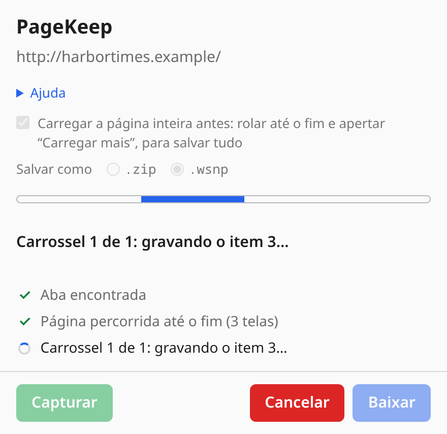
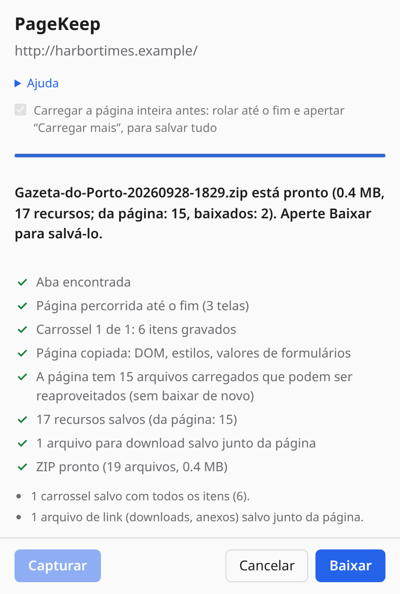
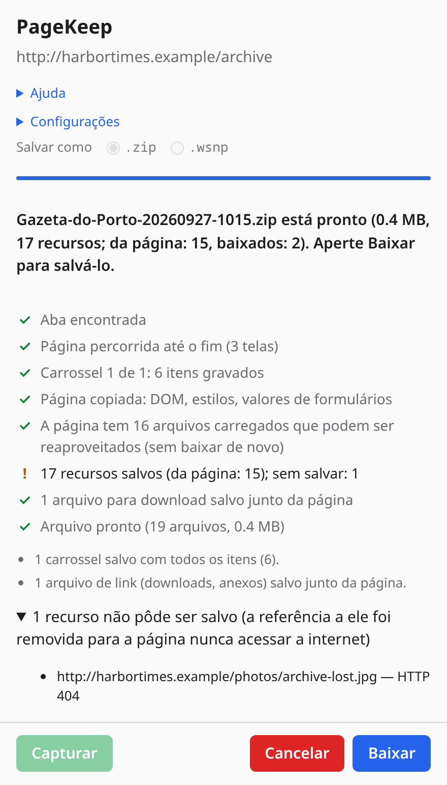
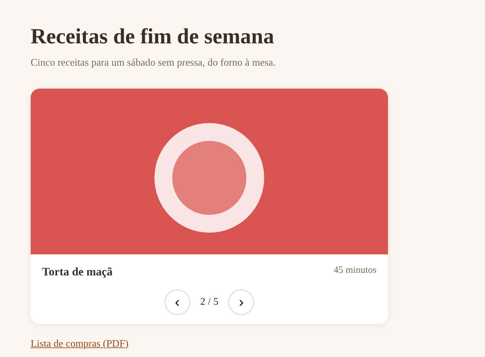
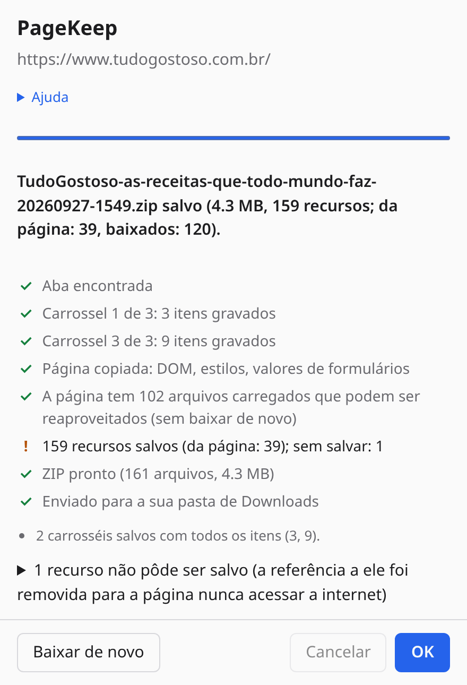
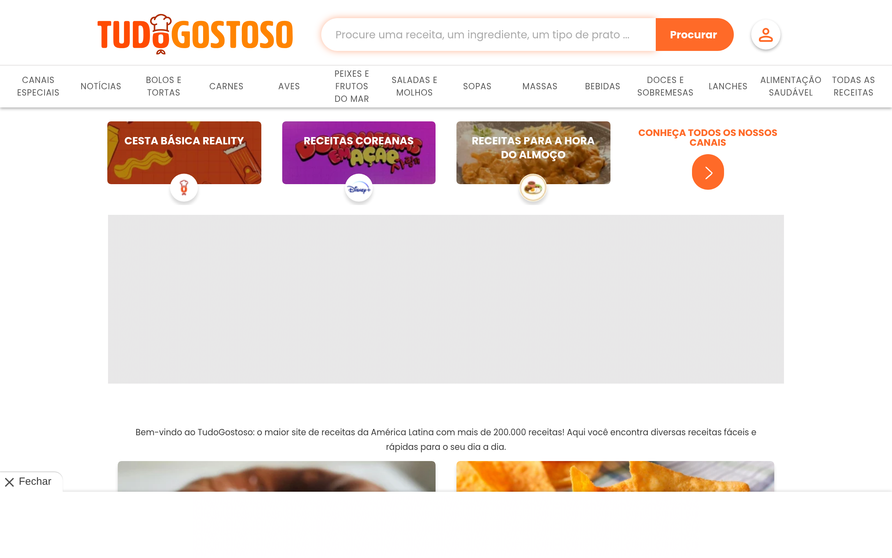

# PageKeep

**PageKeep** (até a versão 1.1.1 chamada Page Snapshot) é uma extensão para navegadores Chromium (Chrome, Opera, Edge e outros; Manifest V3) que salva a aba que você está vendo como um ZIP. Cada folha de estilo, imagem, fonte e ícone é baixado e a página é reescrita para apontar para as cópias locais: basta descompactar e abrir o `index.html`, a qualquer momento e sem internet.

Ela captura a página **como está na tela agora**, e não como o servidor a enviou: conteúdo gerado por JavaScript, o que você digitou em formulários e canvases entram no snapshot.

Os detalhes técnicos (o que é capturado, de onde vêm os arquivos, limitações e permissões) estão no [README da extensão](page-snapshot-extension/README.md). O histórico completo está no [`CHANGELOG.md`](CHANGELOG.md).

## O que ela faz

- **O DOM ao vivo:** conteúdo inserido por scripts, valores atuais de formulários (senhas nunca são salvas), estado de checkboxes e selects, e `<canvas>` (salvo como imagem).
- **Todos os recursos:** CSS (inclusive `@import`, `url()`, estilos criados por JavaScript), imagens (`srcset`, `<picture>`), fontes, posters de vídeo e áudio/vídeo pequenos.
- **Arquivos que a página já carregou:** lidos direto da aba pelo debugger do navegador, com os mesmos bytes que você viu, inclusive imagens que exigem login. O que faltar é baixado pela própria aba (direto, para arquivos do mesmo site, ou pelo debugger, para os de outros sites), com limite de 4 downloads por site e novas tentativas em caso de rate limit (HTTP 429/503). A extensão não tem permissão para nenhum site: só acessa a aba em que você abriu o popup (`activeTab`).
- **Interatividade que continua funcionando offline:** seções recolhidas, acordeões, botões "Expandir tudo" / "Recolher tudo", abas e carrosséis (botões "Próximo" / "Anterior" em português, inglês ou espanhol, com ou sem acento), restaurados por um pequeno script local que nunca acessa a rede.
- **Editores de código (Monaco / VS Code):** viram texto comum, rolável e selecionável, com o arquivo completo quando há link de download; os botões "Copy file" e "word wrap" continuam funcionando.
- **Carrosséis:** a extensão percorre cada item na página ao vivo (e a devolve ao estado em que estava). Os que mostram um item por vez têm todos os itens gravados; os que deslizam uma faixa com todos os itens (Glide, Swiper, Slick, rolagem lateral) têm as posições gravadas. Nos dois casos as setas funcionam na cópia offline.
- **Arquivos para download:** links `<a download>` e documentos do mesmo site (`.zip`, `.pdf`, `.csv`…), até 25 arquivos, vão para `assets/`.
- **Texto cortado com "…mais"** por clamp de CSS aparece inteiro.
- **Progresso ao vivo:** o popup da extensão, embaixo do ícone, mostra cada fase com contadores e o arquivo sendo baixado naquele momento, com os botões **OK** e **Cancel** e uma seção **Help**. A captura continua mesmo com o popup fechado.

## Idiomas

A interface (popup, ajuda do popup, página de ajuda, nome e descrição no navegador e na loja) está em **inglês** e **português do Brasil**. O navegador escolhe pelo idioma dele; qualquer outro idioma usa o inglês. Os textos ficam em `page-snapshot-extension/_locales/`.

## Política de privacidade

[`PRIVACY.md`](PRIVACY.md), em inglês e português, publicada num gist público para a loja: https://gist.github.com/asantos43/a0566af48d0894dc44b72bee43b22da8. Depois de mudar o arquivo: `gh gist edit a0566af48d0894dc44b72bee43b22da8 --filename PRIVACY.md PRIVACY.md`.

## Privacidade: o snapshot nunca acessa a rede

Abrir o `index.html` não faz nenhuma requisição. Os scripts originais da página e os atributos `ping` são removidos, iframes de outros sites (anúncios, telemetria) não são carregados, e qualquer arquivo que não pôde ser salvo tem a referência removida em vez de apontar para o site ao vivo. Links (`<a href>`) continuam levando ao site real quando você está online.

## Estrutura

| Pasta | Conteúdo |
| --- | --- |
| `page-snapshot-extension/` | A extensão (JavaScript puro, sem etapa de build e sem dependências; a pasta mantém o nome antigo) |
| `tests/` | Smoke test com Playwright num Chromium real |
| `docs/` | Notas de desenvolvimento: ambiente, navegadores, versões, releases e origem do repo |
| `.github/workflows/` | A Action que publica uma release a cada pull request mergeado |

## Instalar

A extensão funciona em navegadores Chromium, como **Google Chrome**, **Opera** e **Microsoft Edge**.

1. Abra a página de extensões: `chrome://extensions` (Chrome), `opera://extensions` (Opera) ou `edge://extensions` (Edge).
2. Ligue o **Modo de desenvolvedor**.
3. Clique em **Carregar sem compactação** e escolha a pasta `page-snapshot-extension/`.
4. Se quiser, fixe o ícone na barra de ferramentas.

Depois de atualizar o código, recarregue a extensão na mesma página.

### A partir de uma release

Cada versão é publicada em **Releases** no GitHub como `pagekeep-<versão>.zip`. Baixe, descompacte numa pasta fixa e carregue essa pasta como acima. Para atualizar, substitua o conteúdo da pasta e recarregue a extensão.

## Usar

Clique no botão da barra de ferramentas ou aperte **Alt+Shift+S**. O popup da extensão abre embaixo do ícone, mostra o progresso e, no fim, baixa `<título-da-página>-<AAAAMMDD-HHmm>.zip`.

- Você pode fechar o popup ou clicar na página: a captura continua em segundo plano. Clique no ícone de novo para ver como está. O selo do ícone mostra **…** enquanto roda, **✓** quando termina e **!** se falhou.
- **OK** fica disponível quando a captura termina: limpa o resultado, e o próximo clique no ícone captura a página de novo. **Baixar de novo** (*Download again*) baixa o mesmo ZIP de novo.
- **Cancelar** (*Cancel*) interrompe a captura: os carrosséis voltam ao primeiro item e nada é salvo.
- Uma captura por vez. Abrir o popup em outra aba enquanto uma captura roda mostra essa captura.
- **Ajuda** (*Help*) resume esses pontos no próprio popup, com um link para a página de ajuda completa, com imagens (`help.pt_BR.html` em português, `help.html` em inglês), que faz parte da extensão e funciona offline.

| Durante a captura | Captura terminada | O que não pôde ser salvo |
| --- | --- | --- |
|  |  |  |

A página salva, aberta offline a partir do ZIP, com o carrossel funcionando:



### Um site real: TudoGostoso

A página inicial de https://www.tudogostoso.com.br salva pelo PageKeep: 159 arquivos em 4,3 MB e os dois carrosséis deslizantes da página (3 e 9 posições), que continuam deslizando na cópia; aberta offline, ela não faz nenhuma requisição. O único arquivo que faltou era um endereço de estatísticas de anúncios, e a referência a ele foi removida. O retângulo cinza é um anúncio num quadro de outro site, que a cópia não carrega.

| O popup depois da captura | A cópia aberta offline |
| --- | --- |
|  |  |

Essas duas imagens mostram um site de terceiros, então ficam só neste repositório (`docs/images/readme/`), nunca no pacote da extensão nem na loja. Foram geradas por `tests/readme-images.mjs`, que precisa de internet e falha se a cópia tentar acessar a rede.

As imagens de cima são capturas reais, geradas por `tests/screenshots.mjs` (veja Testes) a partir de um site de notícias inventado (`tests/example-site.mjs`), com fotos desenhadas para o exemplo.

A página capturada continua sendo a aba visível com o popup aberto por cima, então o navegador não a deixa lenta enquanto os carrosséis são percorridos; só não minimize a janela do navegador até a captura terminar.

Descompacte e abra o `index.html`:

```
index.html        a página, com todas as referências apontando para assets/
assets/           CSS, imagens, fontes e ícones
snapshot.json     URL de origem, título, data da captura, cada recurso salvo e cada falha
```

Durante a captura o navegador mostra a barra "Extension started debugging this browser" na aba; ela some quando a captura termina.

## Testes

```sh
cd tests
npm install        # uma vez; o Chromium do Playwright fica em ~/.cache/ms-playwright
npm run smoke      # carrega a extensão e abre as páginas dela
npm run carousel   # captura uma página com carrossel, de ponta a ponta
npm run store-policy   # confere as regras da Chrome Web Store (docs/STORE-POLICY.md)
npm run screenshots    # refaz as capturas do popup nos dois idiomas
```

## Licença

[MIT](LICENSE)
