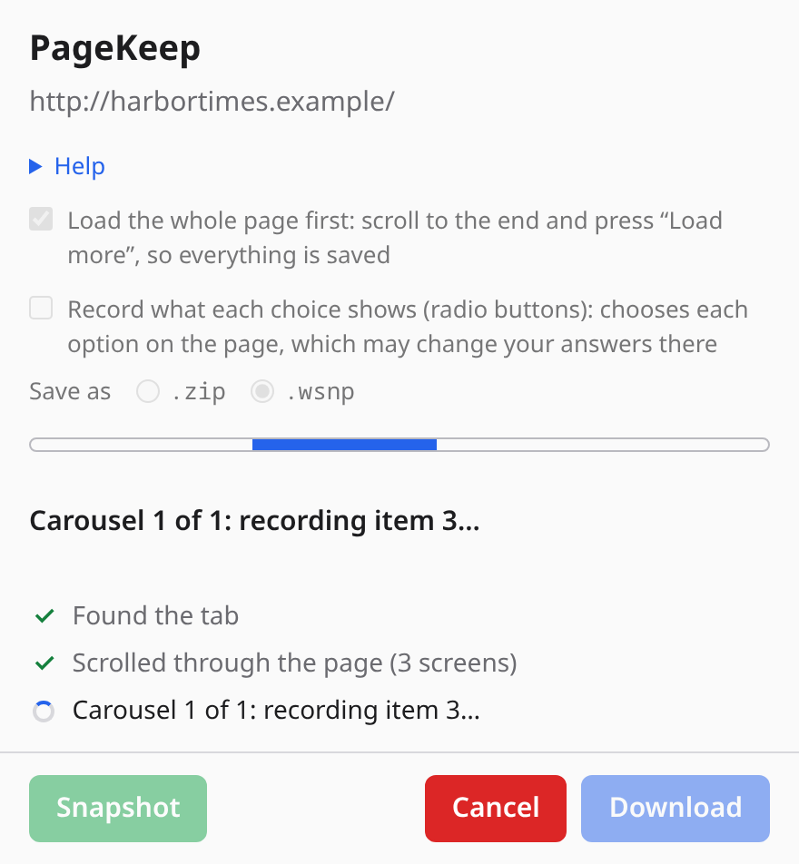
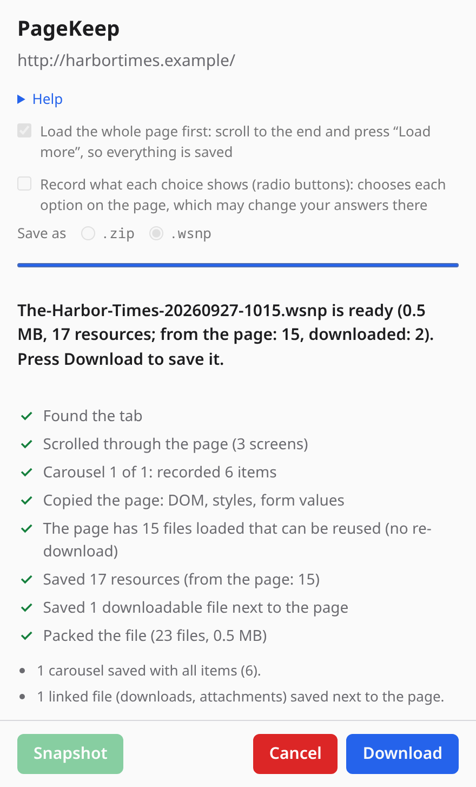
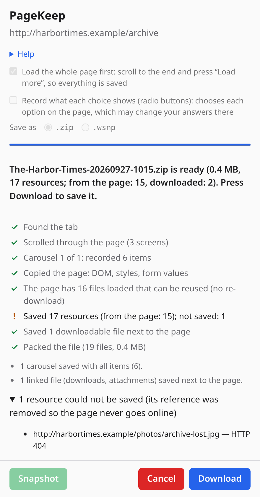
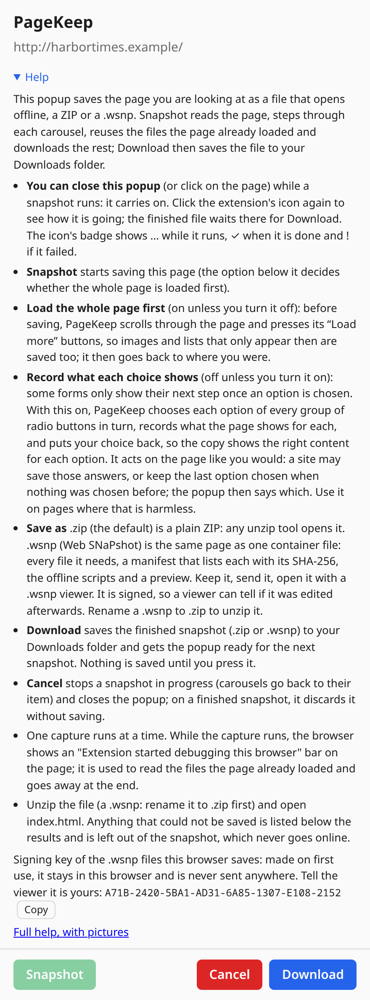
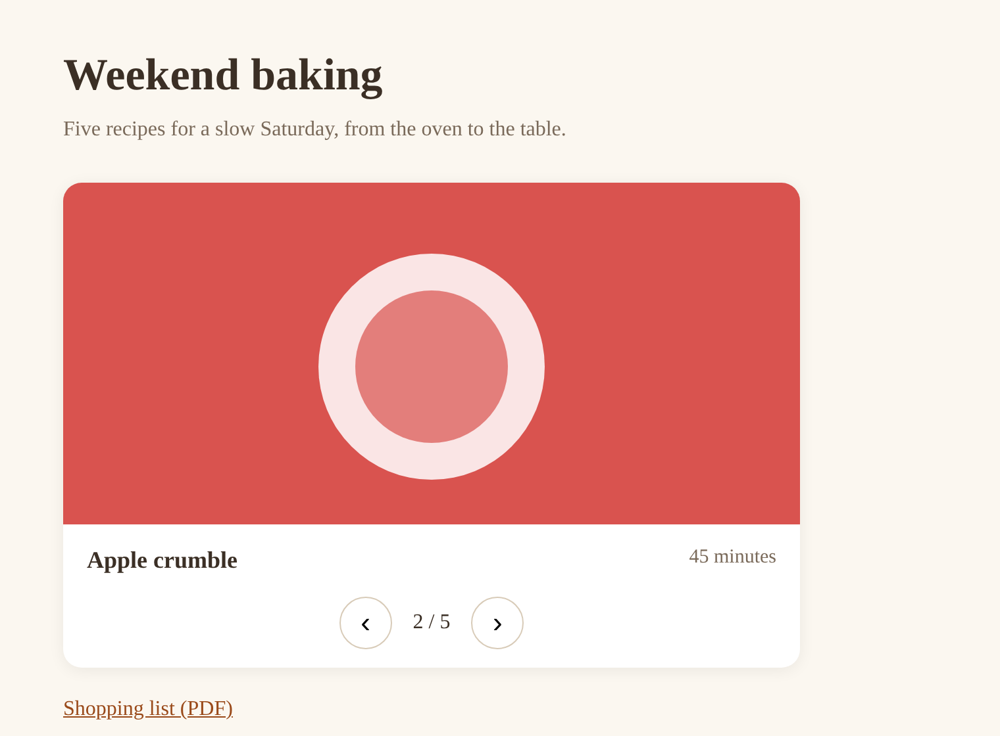

# PageKeep

A Chrome extension that saves the tab you are looking at as a ZIP, or as a `.wsnp` file (see **Save as** below). Every stylesheet, image, font and icon is downloaded and the page is rewritten to point at the local copies, so you can unzip it and open `index.html` offline at any time.

It captures the page **as it is on screen right now**, not as the server originally sent it. That includes content rendered by JavaScript, things you typed into forms, and canvases.

## Install

1. Open `chrome://extensions` and switch on **Developer mode**.
2. Click **Load unpacked** and pick this folder (`page-snapshot-extension/`).
3. Pin the extension if you like.

There is no build step and no dependencies.

## Use

Click the toolbar button, or press **Alt+Shift+S**. The extension's popup opens under its icon with three buttons, **Snapshot**, **Cancel** and **Download**; nothing starts until you press Snapshot (or Enter). The popup then shows what it is doing as it happens: a list with one line per phase (reading editors, stepping through each carousel item by item, copying the page, listing the files the page already loaded, downloading resources with running counts and the file being fetched right now, saving linked files, packing the file), each with a spinner that turns into a check mark when done. When the snapshot is ready, **Download** saves it as `<page-title>-<YYYYMMDD-HHmm>.zip` (or `.wsnp`, see **Save as** below) and gets the popup ready for the next snapshot; nothing is saved before that.

| State | Enabled |
| --- | --- |
| The popup opens (idle) | Snapshot, and the two options below |
| A snapshot runs | Cancel: stops it, puts carousels back and closes the popup |
| The ZIP is ready | Download (saves it, then back to idle) and Cancel (discards it, then back to idle) |
| It failed | Cancel (back to idle) |

- **Load the whole page first** (an option in the popup, on unless you turn it off): before copying, the extension scrolls through the page screen by screen, so images and blocks that only load as you scroll are there too, presses its "Load more" / "Carregar mais" / "Ver mais" / "Cargar más" buttons (up to 5; never a link to another page or a form button), then goes back to where you were. Endless feeds stop after 40 screens or 20 seconds. Set it before pressing Snapshot; it is remembered.
- **Record what each choice shows** (an option in the popup, **off** unless you turn it on; remembered): some forms only build their next step once a radio button is chosen, so it is not in the page until then. With it on, after the carousels, each visible group of radio buttons (native, or `role="radio"`; up to 12 groups of 8 options) gets each option chosen in turn, as a person would (on its label when the input is hidden). The capture first watches the page for a moment to ignore what changes by itself (a countdown), records the area that changes for each option, then puts the original choice back. The copy opens as the page was, and choosing an option swaps in what the page showed for it (`lib/offline/choices.js`). It acts on the live page: a site may save those answers, and one that had nothing chosen may keep the last option (a radio cannot be unticked by a click); the popup then warns, naming the option left chosen. Only one level is recorded: a question that appears after a choice has no recordings of its own.
- **Save as** `.zip` / `.wsnp` (`.zip` unless you choose otherwise; remembered; locked while a capture runs):
  - `.zip` is a plain ZIP: any unzip tool opens it, and `index.html` works offline in a browser.
  - `.wsnp` is the same page as one file, a **container** in the **Web SNaPshot** format defined in [`docs/FORMAT.md`](../docs/FORMAT.md): the page and every file it needs in a single ZIP with a fixed structure, a manifest that names the page's address, title and description and lists every file with its type, size and SHA-256, the offline scripts in `_wsnp/`, and a preview picture. It can be kept, sent and opened with a `.wsnp` viewer; to unzip it yourself, rename it to `.zip`.
  - A `.wsnp` is **signed**, so a viewer can tell if it was edited afterwards: a key pair made the first time it is needed and kept only in this browser (Ed25519, or ECDSA P-256 where the browser lacks Ed25519; the private key is a non-extractable `CryptoKey` in the extension's IndexedDB, never exported and never sent anywhere) signs `manifest.json`, and the public key and its fingerprint go into `signature.json`. The popup's Help shows the fingerprint, with a Copy button, to tell the viewer the key is yours. If signing is not possible the file is saved unsigned, which is still a valid file. A `.zip` is not signed.
  - The viewer is the **WSNP Viewer**, a separate desktop application (Linux, Windows, macOS) in its own repository, still in development: it has no release yet. Until then, rename a `.wsnp` to `.zip` to unzip it.
- You can close the popup, or click on the page: the capture carries on in the background. Click the icon again to see how it is going. The icon's badge shows **…** while it runs, **✓** when it is done and **!** if it failed.
- A finished capture waits for Download or Cancel, even if you close the popup or open it on another tab.
- **Cancel** during a capture stops it: carousels are put back to the item they were on and nothing is saved.
- One capture runs at a time. Opening the popup on another tab while one runs shows that capture.

The page you capture stays the visible tab while the popup is open over it, so the browser does not slow it down while carousels are stepped through; just keep the browser window from being minimized until the capture ends. The popup's **Help** section explains all this in short, and links to the full help page, with pictures (`help.html`, or `help.pt_BR.html` in Portuguese), which is part of the extension and works offline.

| While it runs (`.wsnp`) | Finished (`.wsnp`) | What could not be saved (`.zip`) |
| --- | --- | --- |
|  |  |  |

The screenshots are real, made by `tests/screenshots.mjs`.

The popup's Help explains the two kinds of file and shows the signing key's fingerprint (the one in this picture is a sample):



Unzip it (a `.wsnp`: rename it to `.zip` first) and open `index.html`. You can turn off the network to check that it is self-contained.



## Languages

The popup, its Help, the help page, and the name and description shown by the browser and the store are in English (the default) and Brazilian Portuguese; the browser picks one by its own language. The texts are in `_locales/en` and `_locales/pt_BR`, with the same keys. The popup translates everything, including the steps the capture reports: the offscreen page has no `chrome.i18n`, so it sends message keys with their values, and `popup.js` turns them into text.

## Layout

A `.zip`:

```
index.html        the page, with every reference pointing into assets/
assets/           the page's files, sorted by kind (names like logo-1k3f9a.png):
  images/           pictures, icons, SVG, pictures of frames from other sites
  styles/           stylesheets
  fonts/            fonts
  media/            video, audio, subtitles
  files/            files the page links to for download (PDF, archives…), and anything else
snapshot.json     source URL, title, capture time, every resource saved, and every failure
```

A `.wsnp` (see [`docs/FORMAT.md`](../docs/FORMAT.md)):

```
mimetype          application/vnd.wsnp+zip (first, not compressed: identifies the file)
manifest.json     format version (1.1 when signed), source address, title, description,
                  viewport, every file with its type, size and SHA-256, and what could not be saved
signature.json    the signature of manifest.json (the public key, its SHA-256 and the signature)
index.html        the page (no inline script)
assets/           as in the .zip
_wsnp/offline.js  the extension's offline scripts for this page
_wsnp/preview.jpg a picture of the page as it was on screen
```

## What gets captured

- The live DOM: dynamically inserted content, current form values (password fields are never saved), checkbox/select state, and `<canvas>` content (saved as an image).
- Stylesheets, including `@import` chains, `url()` references (fonts, backgrounds), inline `<style>` and `style=""` attributes, and styles created from JavaScript (`insertRule`, adopted stylesheets).
- Images, including `srcset` and `<picture>` (the image the browser actually picked is kept), video posters, and small audio/video files.
- Collapsed sections ("Overview", FAQs, accordions) and tabs with their hidden content. They still open, close and switch when you click them, and "Expand All" / "Collapse All" buttons work.
- Code and text editors (Monaco, the VS Code editor, used for prompts and patch viewers). Such editors draw only the visible lines and scroll with JavaScript, so they are saved as ordinary scrollable, selectable text instead. The text is taken from the complete linked file when the editor has a download link, otherwise read from the editor itself; if neither works, only the lines that were on screen are saved and the popup warns you. Their "Copy file" and "word wrap" buttons keep working.
- Carousels whose arrow buttons are labelled (`aria-label`) "Next" / "Previous" in English, Portuguese or Spanish: the word alone ("Next", "Próximo", "Siguiente", "Anterior") or with what it moves ("Next slide", "Próxima imagem", "Imagen anterior"). Labels are compared without accents or capitals, so "Proximo" and "PRÓXIMO" count too. A button that would submit a form (a sign-up wizard's "Next") is never pressed. Many only keep the current item in the page, so the extension briefly steps through every item of the live page, starting from the first one even if the carousel was elsewhere (it goes back first and returns it to the item you were on), then embeds all of them; the copy opens on the item you were on. Previous/Next work offline.
  - Carousels that keep **only the current item** in the page: every item is recorded and embedded, and Next / Previous swap them in offline.
  - Carousels that keep **every item in the page** (Glide, Swiper, Slick, Owl, Bootstrap, fading carousels, strips that scroll sideways…): the extension presses Next through every step and records, at each one, where the strip sits (when one moves), the state of every part that changes (the "active" item and dot, `aria-hidden`…) and how the arrows look (greyed out or hidden at the ends), then puts the page back. Offline, the arrows and the dots replay those steps, whatever library the site used.
- Downloadable files: `<a download>` links (attachments, patches, whose links are often temporary signed URLs), plus links on the same site to archives and documents (`.zip`, `.pdf`, `.csv`, ...), up to 25 files, are saved into `assets/files/` and the links point to them.
- Open shadow DOM (web components) and same-origin iframes.
- Text that was cut off with "…more" by a multi-line CSS clamp (feed posts, descriptions) is shown in full, and the dead "more" button is removed. Single-line ellipsis (titles, names) is left as you saw it.

Links (`<a href>`) are made absolute, so clicking one opens the real site when you are online. Links to a place in the page itself stay in the saved page: the page's address with `#section`, and the links some sites use to jump by script (`?jumpTo=bookmark:overview` for an element marked `data-bookmark-id="overview"`, or a parameter naming an element's `id`) become `#…` links; jumping there opens the closed section it is in (or that comes right after it), below any bar pinned to the top.

## Limitations

- **Only some interactivity survives.** The page's own scripts are removed on purpose, because re-running them offline would re-render or break the page. Instead the extension embeds small scripts of its own, from its offline library (`lib/offline/`, no network access), that restore behaviour whose content is already in the saved page: collapsible sections / accordions, "Expand all" / "Collapse all" buttons, tabs, carousels (both kinds, below, with their arrows and dots), photo galleries (the large pictures are saved; a thumbnail opens its picture over the page), modals and dialogs (Bootstrap, `<dialog>`, `role="dialog"`), Bootstrap drop-down menus, collapses and tabs, and editor buttons. A saved page only gets the scripts it needs. Menus, search boxes, drop-down pickers (such as a carousel's "jump to item" list) and anything else that needs the site's own code will not respond, and content a page only builds when you click, rather than hiding it, was never in the page and cannot be saved (except what radio buttons show, with the opt-in option **Record what each choice shows**).
- "…more" only works when the full text is already in the page and merely clipped. If a site cuts the text in JavaScript and downloads the rest when you click, the rest was never in the page and cannot be saved.
- Cross-origin iframes (ads, embedded players, maps) cannot be read: the copy shows a picture of how each looked (below). `blob:`/streamed video and closed shadow roots are not captured.
- Resources over 30 MB, or past 800 MB total, are skipped. A resource that could not be saved is listed in `snapshot.json` (or the `.wsnp` manifest's `failed`) and in the popup, and its reference is removed from the page (see below).
- If Chrome refuses to attach the debugger, only the files from the page's own site can be saved; the others are listed as failed.
- Chrome does not let extensions read `chrome://` pages or the Chrome Web Store.
- To capture `file://` pages, enable **Allow access to file URLs** for the extension on `chrome://extensions`.

## The snapshot never goes online

Opening `index.html` makes no network requests, so it is private and does not "phone home" (LinkedIn, for example, embeds hidden ad-verification and telemetry frames):

- The page's scripts are removed, and so are `ping` attributes.
- `<link>` elements are kept only when the browser never downloads them by itself (canonical, alternate, author, next/prev and the like); stylesheets and icons are saved locally, and every other type is removed (preload, prefetch, manifest, `compression-dictionary`, which ad scripts use, and any type browsers add later).
- Cross-origin iframes cannot be captured. Invisible ones (tracking) are removed. A visible one keeps its box, with its original address in a `data-snapshot-src` attribute, and shows a picture of how it looked: the debugger photographs its place on the page (scrolling it into view first; frames pinned to the screen, such as ad bars, are photographed first, before any scrolling), and the frame gets a local `srcdoc` with that picture. Without the debugger the box stays empty. An ad bar that closes once the page has been scrolled (by the "Load the whole page first" option) may come out empty.
- Any image, font, stylesheet or other file that could not be saved has its reference removed (or replaced with an empty `data:` URL in CSS) instead of pointing at the live site. Links you click (`<a href>`) still go to the real site.

If a resource failed only because of a temporary problem (a timeout), the popup lists it, so you can simply capture again.

## Where the files come from

Chrome gives extensions no direct access to its disk cache. Instead, during a capture the extension briefly attaches Chrome's debugger to the tab and asks for the resources the page **already loaded** (`Page.getResourceTree` / `Page.getResourceContent`). Those are the exact bytes you saw, including login-only images and cross-origin files, with no new request. Anything the tab does not have is downloaded by the tab itself, never by the extension:

1. **From inside the tab** (files from the page's own site), so the page's own cookies and HTTP cache are used.
2. **Through the debugger** (`Network.loadNetworkResource`, the way DevTools loads source maps) for files from other sites. The request comes from the page, so the extension needs no permission for any website. Cookies are not sent to those other sites (the browser treats it as a third-party request).

Downloads are throttled to 4 at a time per site, and a rate-limited response (HTTP 429/503) is retried up to 3 times with back-off, honouring `Retry-After`. Big sites such as LinkedIn rate-limit bursts of requests.

`snapshot.json` records `"source": "page"` (the tab's loaded resources), `"tab"` or `"network"` for every resource. If the debugger could not be attached, the reason is shown in the popup and stored in `snapshot.json` under `"debugger"`.

While it runs, Chrome shows an "Extension started debugging this browser" bar on the tab. It disappears when the capture finishes.

## Permissions

- **`activeTab`**: access to the tab you open the popup on, and only that tab. The extension has no permission for any website.
- **`debugger`**: reads the files the tab already loaded, and downloads the missing ones in the page's own context, as described above. Attached only to that tab, only while the capture runs.
- **`scripting`**: reads the DOM of the tab you clicked on.
- **`offscreen`**: the capture runs in a hidden extension page, so it carries on when the popup closes.
- **`downloads`**: saves the finished file (ZIP or `.wsnp`) to your Downloads folder (the popup may be closed by then).
- **`storage`**: keeps the capture's progress for the popup while it runs (session storage, cleared when the browser closes), and the popup's two options, "Load the whole page first" and "Save as" (local storage). The signing key of the `.wsnp` files is in the extension's own IndexedDB, which needs no permission.

The extension only touches a tab when you click the button, and nothing is sent anywhere: everything stays in your browser until the file is saved to disk. The Chrome Web Store checklist, with the reasons for each permission, is in [`docs/STORE-POLICY.md`](../docs/STORE-POLICY.md).

## Files

| File | Role |
| --- | --- |
| `manifest.json` | Manifest V3 config |
| `background.js` | Service worker: starts a capture when the popup opens, keeps its progress, and makes the tab, debugger and download calls for the offscreen page |
| `popup.html/.css/.js` | The popup under the icon: Snapshot, Cancel, Download, the option, progress, Help |
| `_locales/en`, `_locales/pt_BR` | Every text of the popup, its Help and the manifest |
| `help.html`, `help.pt_BR.html`, `help.css` | The full help page, in English and Portuguese; the popup links to the one in its language (`help_page` message) |
| `images/screenshots/en`, `images/screenshots/pt_BR` | Screenshots for the help pages and READMEs, made by `tests/screenshots.mjs` |
| `offscreen.html/.js` | Hidden page that does the capture: downloads assets, rewrites URLs, builds the ZIP |
| `inpage.js` | Runs inside the tab; snapshots the live DOM and its state |
| `lib/helpers.js` | Pure helpers: CSS/`srcset` rewriting, file naming |
| `lib/zip.js` | Dependency-free ZIP writer |
| `lib/signing.js` | The installation's signing key (Web Crypto, IndexedDB) and the signature of a `.wsnp`'s manifest |
| `inpage-main.js` | Runs in the page's own JavaScript world to read the full text of Monaco editors |
| `lib/offline/` | The offline library: one small local script per kind of element (`disclosure.js`, `tabs.js`, `pager.js`, `slider.js`, `lightbox.js`, `modal.js`, `toggles.js`, `editors.js`), listed in `index.js`; a saved page gets the ones it needs |
